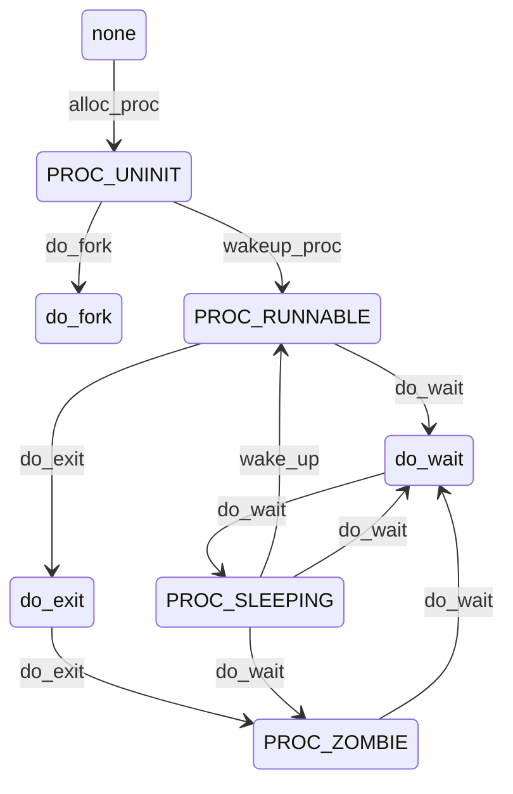

<h1 align = "center">操作系统实验报告</h1>

<h3 align = "center">实验名称：Lab5</h3>

<h4 align = "center">     小组成员：王彬 张泽睿 岳建新</h4>

## 一、实验目的

* 了解第一个用户进程创建过程
* 了解系统调用框架的实现机制
* 了解ucore如何实现系统调用sys\_fork/sys\_exec/sys\_exit/sys\_wait来进行进程管理

### 二、实验过程

### 练习0：编写已有实验

填写代码中需要更新代码的部分主要在两个函数中：

+ alloc_proc 函数中，需要添加对PCB中在LAB5中新增成员变量的初始化，涉及的成员变量为： wait_state 、 cptr 、 yptr 、 optr ，具体代码如下：

  ```c
  proc->wait_state = 0;
  proc->cptr = NULL; // Child Pointer 表示当前进程的子进程
  proc->optr = NULL; // Older Sibling Pointer 表示当前进程的上一个兄弟进程
  proc->yptr = NULL; // Younger Sibling Pointer 表示当前进程的下一个兄弟进程
  ```

+  do_fork 函数中，需要添加设置当前进程的wait_state成员为0，而且还需要设置进程间的关系链 接，其中设置进程间的关系链接利用到的函数是 set_links ，具体代码如下

  ```c
  if((proc = alloc_proc()) == NULL)
  {
      goto fork_out;
  }
  proc->parent = current; // 添加
  assert(current->wait_state == 0);
  if(setup_kstack(proc) != 0)
  {
      goto bad_fork_cleanup_proc;
  }
  ;
  if(copy_mm(clone_flags, proc) != 0)
  {
      goto bad_fork_cleanup_kstack;
  }
  copy_thread(proc, stack, tf);
  bool intr_flag;
  local_intr_save(intr_flag);
  {
      int pid = get_pid();
      proc->pid = pid;
      hash_proc(proc);
      set_links(proc);
  }
  local_intr_restore(intr_flag);
  wakeup_proc(proc);
  ret = proc->pid;
  ```


### 练习1: 加载应用程序并执行（需要编码） 

***do\_execv**函数调用`load_icode`（位于kern/process/proc.c中）来加载并解析一个处于内存中的ELF执行文件格式的应用程序。你需要补充`load_icode`的第6步，建立相应的用户内存空间来放置应用程序的代码段、数据段等，且要设置好`proc_struct`结构中的成员变量trapframe中的内容，确保在执行此进程后，能够从应用程序设定的起始执行地址开始执行。需设置正确的trapframe内容。*

*请在实验报告中简要说明你的设计实现过程。*

- *请简要描述这个用户态进程被ucore选择占用CPU执行（RUNNING态）到具体执行应用程序第一条指令的整个经过。*

#### 代码

将`sp`设置为栈顶，`epc`设置为文件的入口地址，`sstatus`的`SPP`位清零，代表异常来自用户态，之后需要返回用户态；`SPIE`位清零，表示不启用中断。

```c
tf->gpr.sp = USTACKTOP;  // Set the user stack top
tf->epc = elf->e_entry; // Set the entry point of the user program
tf->status = sstatus & ~(SSTATUS_SPP | SSTATUS_SPIE); // Set the status register for the user program
```

### 在 `do_execve` 中，用户态程序的加载与执行过程

在 `do_execve` 中，我们需要将用户态的程序加载到内核态并执行。`load_icode` 函数的主要流程如下：

1. 创建一个新的 `mm_struct`。
2. 创建一个新的页目录表（PDT），并将 `mm` 的 `pgdir` 设置为该 PDT 的虚拟地址。
3. 读取 ELF 格式文件，检验其合法性。然后循环读取每一个程序段，将需要加载的段加载到内存中，并设置相应段的权限。之后初始化 BSS 段，并将其清零。
4. 设置用户栈。
5. 设置当前进程的 `mm`，`cr3`，以及其他相关的寄存器。
6. 设置 `trapframe`，将 `satp` 寄存器配置好，`gpr.sp` 指向用户栈顶。设置 `sstatus` 寄存器，`epc` 寄存器为 ELF 文件的入口地址，设置 `SSTATUS_SPP` 为 0，表示退出当前中断后进入用户态，设置 `SSTATUS_SPIE` 为 1，表示退出当前中断后开启中断。

### 用户态进程的选择与执行流程

用户态进程的执行流程从 `proc_init` 开始。`proc_init` 会创建第一个内核线程 `idle`，并通过 `kernel_thread` 创建 `init` 线程。接下来，`cpu_idle` 会持续检查 `need_resched` 标志位，并调用 `schedule` 函数来进行调度。当 `schedule` 找到一个可调度的线程时，`proc_run` 函数会被调用，进程会切换到该线程。

`proc_run` 会调用 `lcr3` 和 `switch_to`，然后返回 `kernel_thread_entry`，执行 `initproc` 线程的主函数 `init_main`。

> 这个流程与 Lab4 中的流程一致，但后续有些变化。因为在这个版本中，`init_main` 函数不再只有几个打印语句，而包含了更复杂的操作。

在 `init_main` 中，我们再次使用 `kernel_thread` 创建了一个新的线程，执行我们希望运行的用户程序，即 `user_main`。`user_main` 函数在默认情况下会调用 `KERNEL_EXECVE(exit)`，而 `KERNEL_EXECVE` 宏最终会触发 `kernel_execve` 函数。在 `kernel_execve` 函数中，通过内联汇编使用 `ebreak` 指令生成断点中断，并通过设置 `a7` 寄存器为 10 来标识这并非普通的断点中断。这个中断会在 `trap.c` 文件中被处理，触发 `syscall` 函数的执行（该函数在 `trapentry.S` 中定义）。

与此同时，在 `kernel_execve` 函数的内联汇编中，将 `sysexec` 宏放入 `a0` 寄存器，从而发起一个系统调用。该系统调用对应的函数是 `sys_exec`，该函数会进一步调用 `do_execve`。`do_execve` 会调用 `load_icode` 来将新的二进制程序加载到内存，同时设置中断帧的相关信息，包括将 `SPP` 设置为 0，使其可以顺利返回到用户态。

创建 `user_main` 线程后，`init_main` 并不会立即执行它，而是继续执行后续操作。此时，`do_wait` 函数会被调用，当前进程会被释放。对于当前进程而言，`user_main` 是唯一的子进程，并且该子进程的状态并非僵尸进程。因此，当前进程会进入 `sleeping` 状态，并标记为 `WT_CHILD`。随后，调用 `schedule` 函数进行进程调度，此时调度器会选择 `user_main` 进行执行。

在 `user_main` 被执行之前，会按照前述步骤加载二进制程序，并将 `exit` 应用程序的执行代码覆盖到 `user_main` 的用户虚拟内存空间中。接着，执行 `kernel_execve_ret` 函数，并通过 `sret` 指令返回到用户态。此时，`initcode.S` 中的代码开始执行，最终进入 `user_main` 函数。

在 `user_main` 中，首先会执行 `exit.c` 文件中的主体函数，然后调用 `exit` 函数退出。在 `exit` 函数的主体部分，会先通过 `fork` 创建一个子进程。随后，在 `wait` 函数中进行进程切换，并重新执行该函数。父进程会回收由 `fork` 创建的子进程，并最终退出。

当父进程退出后，控制权会返回到 `initproc` 这个内核线程，并通过 `do_exit` 函数触发 `panic`，标志着本次实验的结束。

### 练习2: 父进程复制自己的内存空间给子进程（需要编码） 

*创建子进程的函数`do_fork`在执行中将拷贝当前进程（即父进程）的用户内存地址空间中的合法内容到新进程中（子进程），完成内存资源的复制。具体是通过`copy_range`函数（位于kern/mm/pmm.c中）实现的，请补充`copy_range`的实现，确保能够正确执行。*

*请在实验报告中简要说明你的设计实现过程。*

- *如何设计实现`Copy on Write`机制？给出概要设计，鼓励给出详细设计。*

> *Copy-on-write（简称COW）的基本概念是指如果有多个使用者对一个资源A（比如内存块）进行读操作，则每个使用者只需获得一个指向同一个资源A的指针，就可以该资源了。若某使用者需要对这个资源A进行写操作，系统会对该资源进行拷贝操作，从而使得该“写操作”使用者获得一个该资源A的“私有”拷贝—资源B，可对资源B进行写操作。该“写操作”使用者对资源B的改变对于其他的使用者而言是不可见的，因为其他使用者看到的还是资源A。*


* ### **`copy_range` 函数的调用过程：**

  `do_fork()` → `copy_mm()` → `dup_mmap()` → `copy_range()`

  ------

  #### 过程解析

  1. **`do_fork` 函数调用 `copy_mm`：**
     `do_fork` 调用的 `copy_mm` 函数在 Lab4 中没有实现，其他过程与 Lab4 保持一致，即创建一个新进程并将其放入 CPU 中进行调度。本次实验重点是如何将父进程的内存复制到子进程中。
  2. **`copy_mm`：**
     `copy_mm` 函数使用互斥锁来防止多个进程同时访问内存。随后，它会调用 `dup_mmap` 函数。
  3. **`dup_mmap`：**
     `dup_mmap` 接受两个参数，其中前一个 `mm` 是待复制的内存空间，而 `oldmm` 是父进程的内存内容。该函数主要完成了新进程中的内存段创建，但具体的内存复制工作是由 `copy_range` 完成的。

  #### 最终，复制操作进入 `copy_range` 函数：

  `copy_range` 函数的作用是**在内存页级别上复制一段地址范围的内容**。其具体过程如下：

  1. **获取源页表项：**
     首先，`copy_range` 通过调用 `get_pte` 函数从源页表中获取相应的页表项，并检查其有效性。
  2. **创建目标页表项：**
     然后，在目标页表中获取或创建新的页表项，并为新的页分配内存。
  3. **确保源页和目标页都分配成功：**
     确保源页和目标页的内存都成功分配，并准备进行复制操作，具体操作如下：

  ------

  #### **复制操作的四个步骤：**

  1. **获取源虚拟内存地址：**
     通过源页（page），使用宏 `page2kva` 转换为源虚拟内存地址。
  2. **获取目标虚拟内存地址：**
     将要复制的 `n` 个页同样通过 `page2kva` 宏转换为目标虚拟内存地址。
  3. **执行内存内容复制：**
     使用 `memcpy` 将源虚拟地址的内容复制到目标虚拟地址中。
  4. **插入页表：**
     最后，使用前面的参数（`to` 为目标进程的页目录地址，`npage` 为页数，`start` 为起始地址，`perm` 为从页目录项中提取的 `PTE_USER` 权限位）调用 `page_insert` 函数，将目标页插入目标进程的页表中。

  在 `copy_range` 函数中，内存的复制工作是通过页级别操作实现的。通过获取源页的页表项，创建目标页的页表项，并确保两者的内存成功分配，最终使用 `memcpy` 进行内存内容的复制，并通过 `page_insert` 将复制的页插入目标进程的页表中。这些步骤确保了父进程的内存能够成功复制到子进程中。

```c
void src_kvaddr = page2kva(page);  父进程的内存页的 kernel addr
 void dst_kvaddr = page2kva(npage);  子进程的内存页的 kernel addr
 memcpy(dst_kvaddr, src_kvaddr, PGSIZE);  复制内存页
ret = page_insert(to, npage, start, perm);  将子进程的页表项加入到子进程的页表中
```

1. + ### 如何实现 Copy on Write 机制

     - 在 `fork` 时，将父线程的所有页表项设置为只读，确保父进程和子进程共享相同的物理页。
     - 在新线程的内存结构中，仅复制栈和虚拟内存的页表，不为新线程分配新的内存页。
     - 当子进程试图修改某一页内容时，因该页为只读，会触发页异常。
     - 异常处理时，内核会为该页分配新的物理内存，并将原页面的内容复制到新的内存区域，同时更新子进程的页表项。

     ------

     ### 练习三：理解进程执行 `fork` / `exec` / `wait` / `exit` 的实现，以及系统调用的实现

     #### 函数分析

     1. **`fork`**：
        `fork` 是通过发起系统调用来执行 `do_fork` 函数，目的是创建并唤醒一个新的进程。这个过程可以通过 `sys_fork` 或 `kernel_thread` 进行调用。

        - 初始化一个新进程（线程）。
        - 为新进程分配内核栈空间。
        - 为新进程分配新的虚拟内存，或者与父进程共享虚拟内存。
        - 获取父进程的上下文信息及中断帧，并设置当前进程的上下文与中断帧。
        - 将新进程插入到进程哈希表和链表中，确保调度器能够调度它。
        - 唤醒新进程并使其进入就绪状态。
        - 返回新进程的 PID。

        **用户态执行流程**：
        `fork()` → `sys_fork()` → `syscall(SYS_fork)` → `ecall` → 内核态

        **内核态执行流程**：
        `syscall()` → `sys_fork()` → `do_fork(0, stack, tf)`
        在 `do_fork` 中，首先调用 `alloc_proc` 为新进程分配 `proc_struct` 并设置父进程。然后，调用 `setup_kstack` 为子进程分配内核栈，接着调用 `copy_mm` 根据 `clone_flag` 决定是复制还是共享内存。随后，调用 `copy_thread` 将进程的上下文与中断帧设置到新进程中，并将其插入到 `hash_list` 和 `proc_list` 中。最后，调用 `wakeup_proc` 使新进程变为可调度状态，并返回子进程的 PID。

     2. **`exec`**：
        `exec` 通过系统调用执行 `do_execve` 函数，主要用于加载并执行用户程序。

        - 回收当前进程的虚拟内存空间。
        - 为当前进程分配新的虚拟内存，并加载新程序。

        **内核态执行流程**：
        `kernel_execve()` → `ebreak` → `syscall()` → `sys_exec()` → `do_execve()`
        在 `do_execve` 中，首先检查用户提供的程序是否合法。如果当前进程已经有内存映射，则进行清理操作，包括切换到内核页表、释放进程的内存映射、销毁页目录表及内存管理结构等。然后，调用 `load_icode` 函数将 ELF 格式的程序加载到内存中，设置新的程序名称（通过 `set_proc_name`）。程序加载完成后，返回到用户态执行新程序。

     3. **`wait`**：
        `wait` 通过系统调用执行 `do_wait` 函数，主要用于等待子进程退出并收集其退出状态。

        - 查找状态为 `PROC_ZOMBIE` 的子进程。
        - 如果当前进程有子进程且子进程已退出，则收集子进程的退出状态，并释放子进程资源。
        - 如果子进程未退出，当前进程进入睡眠状态，等待子进程退出。

        **用户态执行流程**：
        `wait()` → `sys_wait()` → `syscall(SYS_wait)` → `ecall` → 内核态

        **内核态执行流程**：
        `syscall()` → `sys_wait()` → `do_wait()`
        在 `do_wait` 中，首先检查当前进程的内存映射是否有效，然后遍历子进程。若找到已退出的子进程且它的父进程是当前进程，则将 `haskid` 标志设置为 1。如果 `pid` 为 0，表示等待任意一个子进程，进入循环查找已退出的子进程。如果没有找到，则调用调度器 `schedule()` 选择下一个可运行进程。如果当前进程标记为 `PF_EXITING`，则调用 `do_exit` 处理退出过程。处理完子进程后，更新父进程的状态并唤醒它。如果是 `initproc` 或 `idleproc` 进程，则触发 `panic`。

     4. **`exit`**：
        `exit` 通过系统调用执行 `do_exit` 函数，用于退出当前进程并释放其资源。

        - 如果当前进程的虚拟内存不被其他进程共享，则销毁该虚拟内存。
        - 将当前进程状态设置为 `PROC_ZOMBIE`，标记其为僵尸进程，并唤醒父进程。
        - 调用 `schedule` 切换到其他可运行进程。

        **用户态执行流程**：
        `exit()` → `sys_exit()` → `syscall(SYS_exit)` → `ecall` → 内核态

        **内核态执行流程**：
        `syscall()` → `sys_exit()` → `do_exit()`
        在 `do_exit` 中，首先检查当前进程是否为 `idleproc` 或 `initproc`，若是，则触发 `panic`。接下来，获取并减少当前进程的内存管理结构引用计数。当引用计数降到零时，释放内存映射并销毁页目录表。如果进程的父进程在等待它退出，则唤醒父进程。然后，处理所有子进程，将它们的状态设置为 `PROC_ZOMBIE`，并将它们重新挂回到 `initproc` 的子进程链表中。如果父进程或 `initproc` 在等待子进程退出，唤醒它们。最后，调用调度器 `schedule()` 进行进程调度。

### 执行流程

+ 系统调用部分在内核态进行，用户程序的执行在用户态进行
+ 内核态通过系统调用结束后的`sret`指令切换到用户态，用户态通过发起系统调用产生`ebreak`异常切换到内核态
+ 内核态执行的结果通过`kernel_execve_ret`将中断帧添加到线程的内核栈中，从而将结果返回给用户

### 生命周期图


## 扩展练习

COW的主体部分均放在`cow.c`文件中。

### COW实现

#### 代码

创建失败时执行，这两项与`proc.c`中相同：

```c
static int
setup_pgdir(struct mm_struct *mm) {
    struct Page *page;
    if ((page = alloc_page()) == NULL) {
        return -E_NO_MEM;
    }
    pde_t *pgdir = page2kva(page);
    memcpy(pgdir, boot_pgdir, PGSIZE);

    mm->pgdir = pgdir;
    return 0;
}

static void
put_pgdir(struct mm_struct *mm) {
    free_page(kva2page(mm->pgdir));
}
```

`do_pgfault`中添加判断页表项权限：

```c
// 判断页表项权限，如果有效但是不可写，跳转到COW
if ((ptep = get_pte(mm->pgdir, addr, 0)) != NULL) {
    if((*ptep & PTE_V) & ~(*ptep & PTE_W)) {
        return cow_pgfault(mm, error_code, addr);
    }
}
```

将`do_fork`函数中的`copy_mm`改为`cow_copy_mm`：

```c
// if(copy_mm(clone_flags, proc) != 0) {
//     goto bad_fork_cleanup_kstack;
// }
if(cow_copy_mm(proc) != 0) {
    goto bad_fork_cleanup_kstack;
}
```

复制虚拟内存空间：

```c
int
cow_copy_mm(struct proc_struct *proc) {
    struct mm_struct *mm, *oldmm = current->mm;

    /* current is a kernel thread */
    if (oldmm == NULL) {
        return 0;
    }
    int ret = 0;
    if ((mm = mm_create()) == NULL) {
        goto bad_mm;
    }
    if (setup_pgdir(mm) != 0) {
        goto bad_pgdir_cleanup_mm;
    }
    lock_mm(oldmm);
    {
        ret = cow_copy_mmap(mm, oldmm);
    }
    unlock_mm(oldmm);

    if (ret != 0) {
        goto bad_dup_cleanup_mmap;
    }

good_mm:
    mm_count_inc(mm);
    proc->mm = mm;
    proc->cr3 = PADDR(mm->pgdir);
    return 0;
bad_dup_cleanup_mmap:
    exit_mmap(mm);
    put_pgdir(mm);
bad_pgdir_cleanup_mm:
    mm_destroy(mm);
bad_mm:
    return ret;
}
```

只复制`mm`与`vma`，将页表项均指向原来的页：

```c
int
cow_copy_mmap(struct mm_struct *to, struct mm_struct *from) {
    assert(to != NULL && from != NULL);
    list_entry_t *list = &(from->mmap_list), *le = list;
    while ((le = list_prev(le)) != list) {
        struct vma_struct *vma, *nvma;
        vma = le2vma(le, list_link);
        nvma = vma_create(vma->vm_start, vma->vm_end, vma->vm_flags);
        if (nvma == NULL) {
            return -E_NO_MEM;
        }
        insert_vma_struct(to, nvma);
        if (cow_copy_range(to->pgdir, from->pgdir, vma->vm_start, vma->vm_end) != 0) {
            return -E_NO_MEM;
        }
    }
    return 0;
}
```

设置页表项指向：

```c
int cow_copy_range(pde_t *to, pde_t *from, uintptr_t start, uintptr_t end) {
    assert(start % PGSIZE == 0 && end % PGSIZE == 0);
    assert(USER_ACCESS(start, end));
    do {
        pte_t *ptep = get_pte(from, start, 0);
        if (ptep == NULL) {
            start = ROUNDDOWN(start + PTSIZE, PTSIZE);
            continue;
        }
        if (*ptep & PTE_V) {
            *ptep &= ~PTE_W;
            uint32_t perm = (*ptep & PTE_USER & ~PTE_W);
            struct Page *page = pte2page(*ptep);
            assert(page != NULL);
            int ret = 0;
            ret = page_insert(to, page, start, perm);
            assert(ret == 0);
        }
        start += PGSIZE;
    } while (start != 0 && start < end);
    return 0;
}
```

实现COW的缺页异常处理：

```c
int 
cow_pgfault(struct mm_struct *mm, uint_t error_code, uintptr_t addr) {
    int ret = 0;
    pte_t *ptep = NULL;
    ptep = get_pte(mm->pgdir, addr, 0);
    uint32_t perm = (*ptep & PTE_USER) | PTE_W;
    struct Page *page = pte2page(*ptep);
    struct Page *npage = alloc_page();
    assert(page != NULL);
    assert(npage != NULL);
    uintptr_t* src = page2kva(page);
    uintptr_t* dst = page2kva(npage);
    memcpy(dst, src, PGSIZE);
    uintptr_t start = ROUNDDOWN(addr, PGSIZE);
    *ptep = 0;
    ret = page_insert(mm->pgdir, npage, start, perm);
    ptep = get_pte(mm->pgdir, addr, 0);
    return ret;
}
```

至此，`make qemu`与`make grade`均能正常运行并通过。

#### 错误复现

在`user/exit.c`文件中添加

```c
uintptr_t* p = 0x800588;
cprintf("*p = 0x%x\n", *p);
*p = 0x222;
cprintf("*p = 0x%x\n", *p);
```

如果使用原本的策略，执行`make qemu`会提示：

```c
*p = 0x5171101
Store/AMO page fault
kernel panic at kern/fs/swapfs.c:20:
    invalid swap_entry_t = 2013281b.
```

但是如果使用COW策略，则会正常运行：

```c
*p = 0x5171101
Store/AMO page fault
COW page fault at 0x800000
Store/AMO page fault
COW page fault at 0x7ffff000
*p = 0x222
waitpid 3 ok.
exit pass.
all user-mode processes have quit.
init check memory pass.
kernel panic at kern/process/proc.c:479:
    initproc exit.
```

这表明我们在`qemu`模拟出的磁盘上的`0x800588`处写入了数据`0x222`。

### 用户程序加载

该用户程序在操作系统加载时一起加载到内存里。我们平时使用的程序在操作系统启动时还位于磁盘中，只有当我们需要运行该程序时才会被加载到内存里。

原因是在`Makefile`里执行了`ld`命令，把执行程序的代码连接在了内核代码的末尾。
